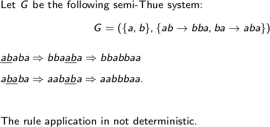
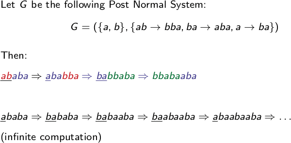

---
title: Advanced Topics of the Turing Tarpit
subtitle: More Gotchas Than PHP
author: Marco Brack \and Carsten Hartenfels
header-includes:
    - \usepackage{mathrsfs}
    - \newcommand{\gotchas}{\underline{Gotchas!}}
...

# Q&A Questions

* Flow chart notation for multi-tape machines? Doesn't seem to be defined in the lecture.

* Is there a no-op machine? We can define our own $\mathcal{M}_{nop}$ with $>RL$ or something, but that's kinda clunky.

* What's up with the weird required `else` in LOOP and illegal `else` in WHILE?

* If the `else` is actually required in LOOP, why is there no no-op statement?

* Do I need to zero out “unused” registers that I don't want to output?

* How do I call sub-programs in LOOP/WHILE/GOTO? How do I call subroutines in Pseudocode?

# Introduction

# Turing Machines and Computability

## Deterministic Turing Machine

A **Deterministic Turing Machine (DTM)** is defined as $\mathcal{M} = (K, \Sigma, \delta, s)$

* Finite set of states $K$
* Alphabet $\Sigma$
* Transition function $\delta : K \times \Sigma$
* Initial state $s \in K$

A configuration is what the DTM looks like at any given moment. It consists of the current state, tape contents and tape head position.

The initial configuration of the machine consists of a single **blank** $\#$, then your input, and then an infinite number of blanks. The tape head is one space beyond your input.

In a single step, the machine can transitions to another state and can either go left $L$, go right $R$ or change the current symbol.

The DTM **halts** when it enters the halting state $h$.

It **hangs** when you make it go beyond the left edge of the tape. We shall this **crash** instead, because that's less confusable with halting.

The DTM **terminates** if it halts or crashes. If the machine loops infinitely, it doesn't terminate, halt or crash.

\gotchas

* The halting state $h$ is not a state: $h \notin K$. Obviously.
* $L$ and $R$ are not allowed in $\Sigma$. Because they're confusable maybe?
* The number of states is $|K| - 1$, because $s$ doesn't count. Despite $s \in K$.
* $\delta$ must be totally defined because Gabe Newell. But you can make the machine hang explicitly by making it go left until it hangs. Which has the same effect as making $\delta$ not total. Which means this artificial restriction is retarded.
* A single input word cannot have blanks in it, but you can give multiple input words separated by blanks. The machine of course cannot distinguish between those two cases. Good.
* The machine can't move and write a symbol in a single step. That would be too convenient. Hope you like creating temporary states.
* Sometimes halting gets called holding because I guess spelling is for weenies.

## Flow Chart Notation

Combines a bunch of machines. When one halts, the next starts. Arrows are used for decisions.

$>$ marks the start state. $L$ goes one space left, $R$ goes one space right.

$L_\#$ and $R_\#$ go left/right until they reach a blank. Small gotcha: they check *after* each step, so at minimum one space is moved. This is usually what you want though.

Any letter $\in \Sigma$ writes that letter onto the tape.

Arrows dictate flow. Bare arrows just transfer control to another machine, and they may be omitted if the flow is linear. Arrows with conditions on them decide on the flow.

TODO: What happens when you don't cover all conditions? Is it even a legal machine (since $\delta$ should be total)? Does it just crash when the condition happens?

## Languages

A **language** $L$ is a set of letter combinations from $\Sigma$.

A DTM **accepts** a language if it halts in the **magical acceptance state** (see gotchas). If it halts in a different state or crashes or doesn't terminate, then it doesn't accept the language.

A DTM **decides** a language if it halts with $\#Y\underline{\#}$ if the input is $\in L$ and halts with $\#N\underline{\#}$ otherwise. That is, as opposed to acceptance, the machine always terminates.

A DTM **enumerates** a language if TODO some really strange blink state stuff? It's supposed to mean that the machine produces every word of the language, but the definition is just weird.

A language is **recursively enumerable** if there exists a DTM that enumerates it.

A languge $L_1$ is **reducible** to a language $L_2$ if you can find a function that transforms every word in $L_1$ to some word in $L_2$.

From these we can derive the following:

**Every decidable language is acceptable.** Proof is trivial, just wrap your decision machine into an acceptance machine.

**The complement of every language is decidable.** Trivial again, just swap the $Y$ and the $N$ of your decision machine.

**$L$ is decidable if $L$ and its complement are acceptable.** Proof: know that turing machines can simulate turing machines. Then build a turing machine that runs your two acceptance machines side by side, stepping each one forward alternatingly. If the machine for $L$ halts, you write $Y$, if the complement halts, you write $N$.

**$L$ recursively enumerable $\Leftrightarrow$ $L$ is acceptable**.

Proof for $\Rightarrow$: let your recursive enumeration machine run and look at every word it produces. If a word matches the input, accept it. Otherwise keep running forever.

Proof for $\Leftarrow$: I have an idea but it's stupid and hard to explain. You make a machine that iterates every possible word from $\Sigma$. This is trivial, because alphabets are always finite. For example for $\Sigma = \lbrace a, b \rbrace$, you get $\epsilon, a, b, aa, ba, ab, bb, ...$. For each of these words, you start a new instance of your acceptance machine and let it run one step. Every machine you created for the previous word is also moved forward one step. If one of your machine halts and accepts the word, you're done. So for example:

1. Get $\epsilon$, create a new acceptance machine for it and run it one step.
2. Get $a$, create a new machine and run it one step. Also run the machine for $\epsilon$ another step.
3. Get $b$, create a new machine, run the other two ones another step.
4. Etc. pp., either until one of your machines accepts or ad nauseam.

While this would require ridiculous amounts of memory and take ages, it's still finite for accepted words, so q.e.d.

\gotchas

* The magical acceptance state looks like this: $\#w\underline{\#}$. That is, the tape just contains the input word and the tape head is one space to the right of that word.
* We overload the $\leq$ operator for reducability. So $L_1 \leq L_2$ means that $L_1$ is reducible to $L_2$. This is different from $L_1 \subseteq L_2$, which looks confusingly similar. And $L_1 \subseteq L_2$ implies $L_1 \leq L_2$, but not the other way round.

# Register Machines

\gotchas

Register machines consist of nothing but gotchas. I doubt the lecture or the tutorial get them right according to their own definitions either.

I'm going by the [official register machine definitions](https://userpages.uni-koblenz.de/~mbender/teaching/16ss_actcs/rm_instr.pdf) here. The lecture might say things differently, but according to the tutorial, the tutorial's definition is the one and only truth.

* Semicolons in register machines **separate** statements, they do not terminate them. So a trailing `;` at the end of a program or a block is illegal.
* Blocks are statements, so they require a semicolon after their `end`. Unless it's the last statement in a program or block.
* No negative numbers. If subtraction would give you a negative number, it turns into $0$ instead.
* `while` can only test $x_i \neq 0$, no other conditions are allowed.
* `if` is completely retarded:
    * In LOOP, `if` can check $x_i = 0$ and $x_i \leq x_j$. In WHILE and GOTO, it can only check $x_i = 0$, comparing registers isn't allowed.
    * In LOOP, an `else` branch is **required**. In WHILE and GOTO, it's **illegal**.
        * Also, every block has at least one statement, so you can't leave your `else` block empty.
        * And no, there's no no-op statement either.
    * In GOTO, there is no `then` after the `if`'s condition because who needs consistency.
* We also have a special [pseudocode definition](https://userpages.uni-koblenz.de/~mbender/teaching/16ss_actcs/pseudocode.pdf), which is similar, but stupidly inconsistent with register machines:
    * Pseudocode doesn't use semicolons at all.
    * Pseudocode variables start at $x_0$, but registers start at $x_1$. Yes, really.
    * Pseudocode allows negative numbers, register machines don't.
    * Pseudocode uses curly braces, register machines use `do ... end`.
    * Pseudocode requires parentheses around `if` and `while` conditions, in register machines they are illegal.
    * Recursive function calls are illegal in pseudocode because Gabe Newell again.
    * You can compare numbers, but only with $=, ~ <$ and $\leq$. But $\neq$, $>$ and $\geq$ don't exist.

# Recursive Functions

\gotchas

* The syntax is horrible and completely unreadable.
* Also what even is the idea behind primitive recursion?
* Dito for $\mu$ recursion. It's like they entered our world from the Æther and nobody knows how they came to be.

# Computability and (Un-)Decidability

## Rice's Theorem

$\mathcal{L}_{0,\Sigma}$ is the set of all languages of type 0 (arbitrary grammar).

$P$ a set of languages that describes some language property. $I(P)$ is the set of languages that fulfills property $P$.

**Rice's theorem** says: for every *non-trivial* property $P$, it is undecidable if a language accepted by a TM has that property.

In this case, non-trivial means that $I(P) \neq \emptyset$ and $I(P) \neq \mathcal{L}_{0,\Sigma}$. Examples:

* $L$ is infinite: non-trivial
* $L$ is acceptable: non-trivial
* $L$ uses more than one letter: non-trivial
* $L$ is of type 0: trivial, because it's $\mathcal{L}_{0,\Sigma}$
* $L$ is blue: trivial, because it's nonsense, so it's $\emptyset$

Proving things like exercise 9.4 is super easy:

1. Find a language that has the property $P$ (so $I(P) \neq \emptyset$)
2. Find a language that doesn't (so $I(P) \neq \mathcal{L}_{0,\Sigma}$)
3. $\Rightarrow$ $P$ is non-trivial, Rice says q.e.d.

## Logic

The set of valid formulas in propositional logic (Aussagenlogik) is decidable.

The set of valid formulas in first-order logic (Prädikatenlogik) is undecidable. Proof was like you can simulate a TM with it or something and therefore it's undecidable.

## Post Correspondence Problem (PCP)

A **correspondence system** $P$ is a finite set of pairs of strings over an alphabet $\Sigma$: $P = \lbrace (p_1, q_1), ... (p_n, q_n) \rbrace, ~ p_i, q_i \in \Sigma^*$.

This system can be **solved** by finding a sequence of indexes $\mathcal{I} = i_1 ... i_m$, so that the concatenation $p_\mathcal{I} = p_{i_1} ... p_{i_m}$ is equal to the concatenation of $q_\mathcal{I} = q_{i_1} ... q_{i_m}$. Indexes may be omitted and repeated.

A **partial solution** means that $p_\mathcal{I}$ starts with $q_\mathcal{I}$ or vice-versa.

### Semi-Thue System (STS)

A system that transforms words for some reason. It has a bunch of rules $R$ that let you replace strings with other strings.

For some reason $R$ isn't enough, you also need the alphabet, so you have to write $G = (\Sigma, R)$.

When given a string of letters, you just non-deterministically pick a rule from $R$ and apply it until you're happy. See example below somewhere.

### Post Normal System (PNS)

Similar to STS, except you always chomp letters off the front of your string and append the rule production to the end. Example is also somewhere here.

\gotchas

* The letter $P$ is decidedly overused.
* Again, what's the point behind the PCP? Who even needs motivation!
* The lecture uses $I$ instead of a fancy $\mathcal{I}$, but that's way too confusable, especially in subscripts. Like, try telling these apart: $p_I p_l p_1 p_i$
* Who in blazes is Thue?

# Complexity
